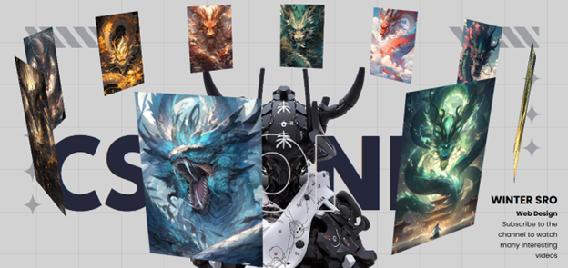

# 3D ANIMATED SCREEN

Nesse projeto eu ensino a criar uma Tela animada em 3D, usando somente HTML, CSS.

# O Poder do CSS: Criando Animações Incríveis.

O CSS (Cascading Style Sheets) é uma ferramenta essencial para estilização na web, mas seu poder vai muito além de simples ajustes de cores e fontes. Com ele, é possível criar animações incríveis que tornam as páginas mais dinâmicas, interativas e envolventes.
Graças a propriedades como @keyframes, transition e animation, os desenvolvedores podem animar elementos suavemente, criando efeitos como deslizamento, fades, mudanças de cor, transformações tridimensionais e até animações complexas sem precisar de JavaScript.
Além de ser uma alternativa leve e eficiente para animações, o CSS também permite otimizações de desempenho, garantindo que os efeitos rodem de forma fluida em diferentes dispositivos.
Seja para pequenos detalhes, como um botão que muda suavemente de cor ao passar o mouse, ou para animações mais elaboradas, como elementos que surgem e se movimentam na tela, o CSS prova que é uma ferramenta poderosa para dar vida às interfaces.
Explore as possibilidades e descubra como o CSS pode transformar a experiência do usuário, tornando seu site mais moderno e atrativo! 🚀